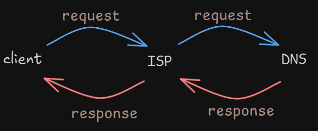
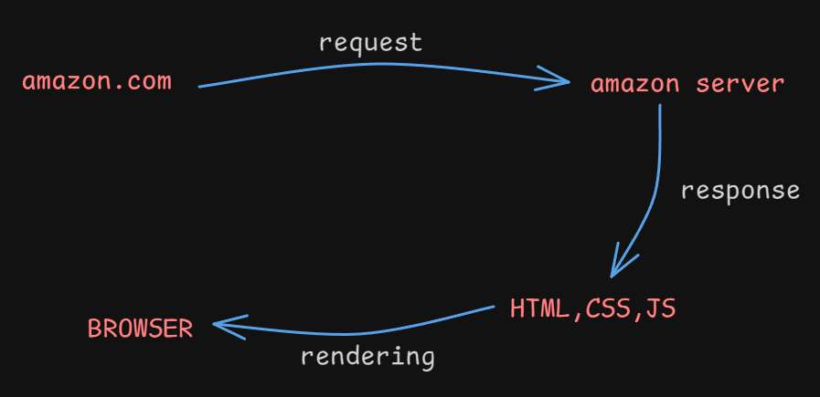

# 🌐 Internet  
### Key Concepts:  
- **Client & Server** – 24/7 online communication  
- **ISP (Internet Service Provider)** – Examples: Airtel, Jio  
- **DNS (Domain Name System)** – Converts domain names into IP addresses  

---

# 💻 Web Development  

### Core Technologies:  
- **HTML** – Structure & Skeleton 🏗️  
- **CSS** – Styling & Design 🎨  
- **JavaScript (JS)** – Functionality & Interactivity ⚙️  

---

# 🚀 To-Do List for MERN Stack Series  

### **Frontend** 🎨  
✅ HTML, CSS, JavaScript  
✅ Bootstrap, Tailwind CSS  

### **Backend** ⚙️  
✅ Node.js, Express.js  

### **Database** 🗄️  
✅ SQL, MongoDB  

### **Framework** ⚛️  
✅ React.js  

