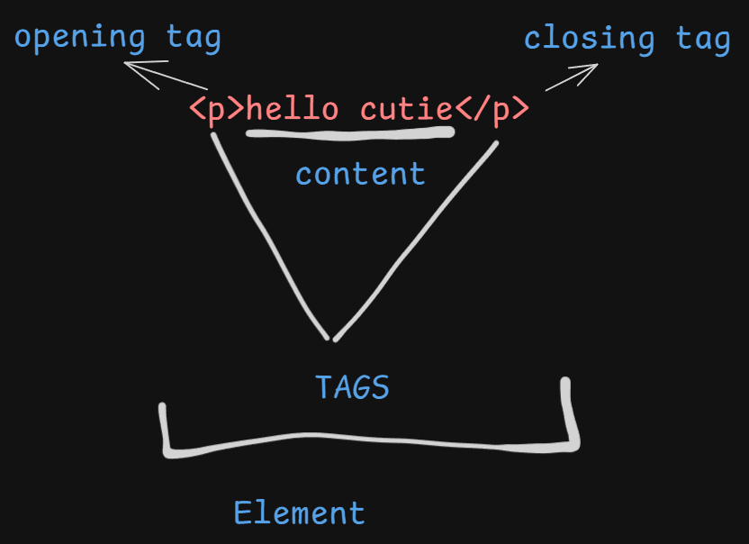
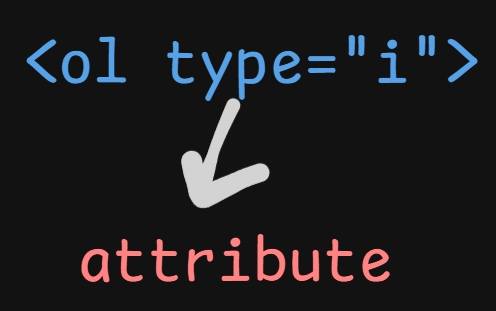

# HTML One-Shot Guide

## Introduction
**HTML (Hypertext Markup Language)** is the standard markup language for creating web pages.

## Elements & Tags

- **Element** = Tag + Content

## HTML Boilerplate
```html
<!DOCTYPE html>
<html lang="en">
<head>
    <meta charset="UTF-8">
    <meta name="viewport" content="width=device-width, initial-scale=1.0">
    <title>My Page</title>
</head>
<body>
    <h1>Welcome to HTML</h1>
</body>
</html>
```

## Attributes

- Provide additional information about elements
- Example: `<a href="https://example.com">Visit Example</a>`

## HTML is Not Case Sensitive
- `<P>`, `<p>` and `<P>` all function the same

## Inline vs Block Elements
### **Block Elements:**
- Start on a new line
- Example: `<div>`, `<p>`, `<h1>`

### **Inline Elements:**
- Stay in the same line
- Example: `<span>`, `<a>`, `<strong>`

## Semantic Markup & Tags
```html
<header>
    <nav></nav>
</header>
<main></main>
<footer></footer>
<article></article>
<section></section>
<aside></aside>
```

## HTML Entities
- `&lt;` `<`
- `&gt;` `>`
- `&amp;` `&`
- `&copy;` `©`
- `&hearts;` `♥`

## Emmet Shortcuts
```html
<!-- nav>ul>li -->
<nav>
  <ul>
    <li></li>
  </ul>
</nav>
<!-- nav+(ul>li)+p -->
<nav></nav>
<ul>
  <li></li>
</ul>
<p></p>
```

## HTML5 Features
- New semantic elements (`<article>`, `<section>`, `<aside>`, etc.)
- Improved forms with new input types (`email`, `date`, `color`)
- Audio & video support (`<audio>`, `<video>`)

## Tables
- `<table>`: Defines a table
- `<tr>`: Table row
- `<td>`: Table data
- `<th>`: Table header
- `rowspan`: Merges rows
- `colspan`: Merges columns

```html
<table border="1">
    <tr>
        <th>Name</th>
        <th>Age</th>
    </tr>
    <tr>
        <td>Alice</td>
        <td>25</td>
    </tr>
</table>
```

## Forms
```html
<form action="/submit" method="POST">
    <label for="name">Name:</label>
    <input type="text" id="name" name="name" required>
    <button type="submit">Submit</button>
</form>
```
- `<input>`: Collects user input
- `<textarea>`: Multi-line input
- `<button>`: Submits form
- `<select>`: Dropdown menu

